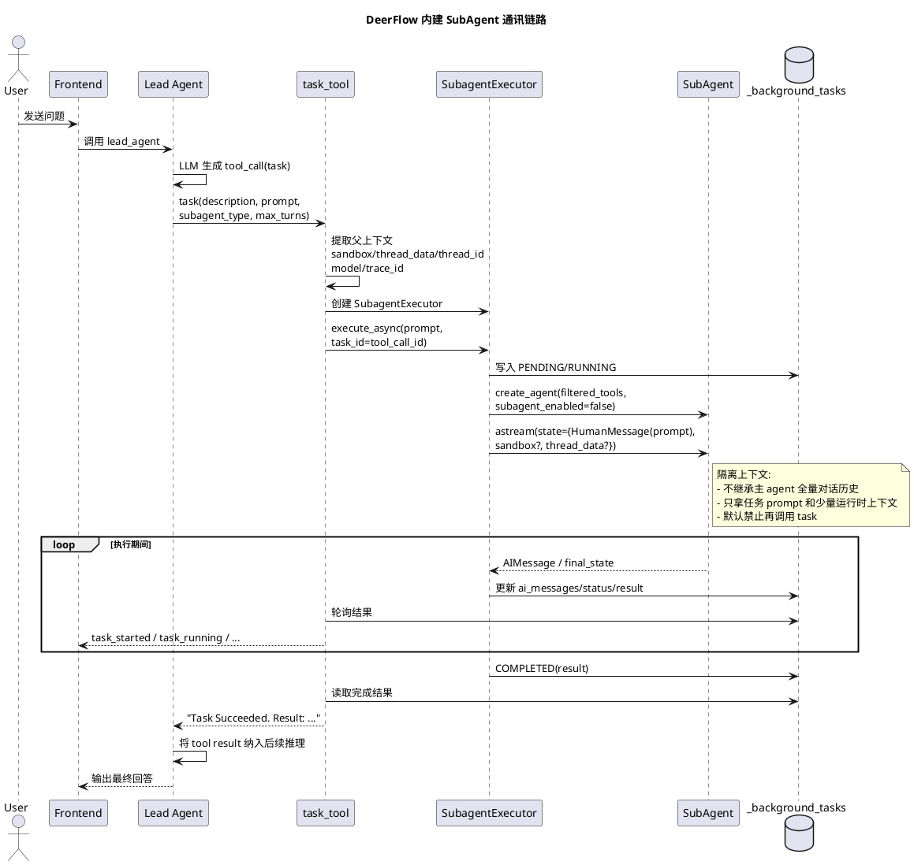
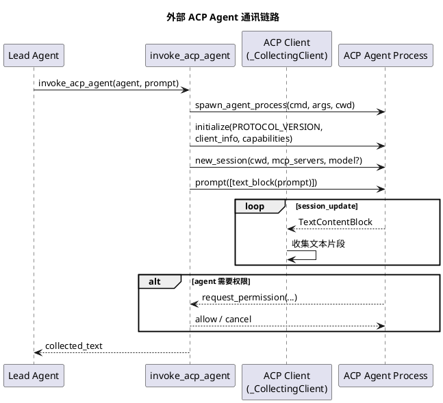

# Lead Agent 与 SubAgent 通讯说明

本文说明 DeerFlow 当前项目中 `lead_agent` 与 `subAgent` 的通讯方式，以及是否存在明确的通信协议。

## 结论

项目里实际有两条不同的链路：

1. `内建 subAgent`
   `lead_agent` 通过内置的 `task` 工具委派任务给子 agent。这条链路**不走独立网络协议**，而是基于 LangGraph/LangChain 的工具调用机制，在后端进程内启动一个新的 agent 实例执行任务。
2. `外部 ACP agent`
   项目也支持通过 `invoke_acp_agent` 工具调用外部 agent。这条链路才使用正式的 **ACP (agent-client-protocol)**。

所以，如果问题是“当前项目主 agent 和 subAgent 之间如何通讯”，答案是：

**默认内建 subAgent 并没有单独定义一套 RPC/A2A 协议，而是 `task` 工具委派 + 后台执行 + 文本结果回传。**

## 一、内建 SubAgent 的通讯方式

主 agent 与内建 subAgent 的交互，本质上是下面这条链路：

1. `lead_agent` 创建时，如果开启了 `subagent_enabled`，工具集中会加入 `task` 工具。
2. 主 agent 推理后生成一个 `task` 类型的 tool call。
3. `task_tool` 接收参数：
   - `description`
   - `prompt`
   - `subagent_type`
   - `max_turns`
4. `task_tool` 从父运行时提取上下文：
   - `sandbox`
   - `thread_data`
   - `thread_id`
   - `parent_model`
   - `trace_id`
5. `task_tool` 创建 `SubagentExecutor`，并以后台任务方式执行。
6. `SubagentExecutor` 在本进程内重新创建一个 agent 实例，并传入筛选后的工具集。
7. 子 agent 执行完成后，最终将结果整理为一个文本结果返回给主 agent。
8. 主 agent 将这个 tool result 继续纳入后续推理，最后组织成最终回答返回给用户。

### 关键点

- 这是**一次性任务委派**，不是持续双向会话协议。
- 子 agent 与主 agent **上下文隔离**，不会直接继承主 agent 的完整消息历史。
- 子 agent 默认拿不到 `task` 工具，避免递归嵌套。
- 主 agent 拿到的主要是**最终结果文本**，不是一套持续交换的结构化消息协议。

## 二、内建 SubAgent 的“通信契约”

虽然它没有单独协议，但仍然存在一个事实上的“契约”：

### 1. 主 agent -> subAgent 的输入契约

通过 `task` 工具传参：

- `description`: 展示/日志用的简短任务描述
- `prompt`: 交给 subAgent 的完整任务说明
- `subagent_type`: 子 agent 类型，目前内建主要有：
  - `general-purpose`
  - `bash`
- `max_turns`: 最大执行轮数，可选

### 2. 运行时透传契约

`task_tool` 会把部分父运行时信息传给 `SubagentExecutor`：

- `sandbox_state`
- `thread_data`
- `thread_id`
- `parent_model`
- `trace_id`

这说明父子 agent 之间不是完全无关，而是共享了执行环境和线程级上下文，但**没有共享完整对话历史**。

### 3. subAgent -> 主 agent 的输出契约

子 agent 最终回到主 agent 的内容，本质上是一个字符串：

- 成功: `Task Succeeded. Result: ...`
- 失败: `Task failed. Error: ...`
- 超时: `Task timed out. Error: ...`

因此，从主 agent 的视角看，subAgent 更像一个“复杂工具”，而不是一个长期在线、持续协商的对等 agent。

## 三、前端可见的事件流

虽然主 agent 和 subAgent 内部没有单独协议，但后端会向前端流式发送任务状态事件。当前可见的事件类型包括：

- `task_started`
- `task_running`
- `task_completed`
- `task_failed`
- `task_timed_out`

这些事件主要用于前端展示 subtask 的执行状态与中间消息，不等同于主/子 agent 间的正式通信协议。

## 四、PlantUML: 内建 SubAgent 通讯时序图

## 五、外部 ACP Agent 是另一条链路

项目还支持 `invoke_acp_agent`，但它不是 DeerFlow 内建 subAgent 机制，而是调用外部 ACP 兼容 agent。

这条链路会使用正式 ACP 协议，典型过程包括：

1. `spawn_agent_process(...)`
2. `initialize(PROTOCOL_VERSION, ...)`
3. `new_session(...)`
4. `prompt([text_block(prompt)])`
5. 通过 `session_update(...)` 接收文本流

也就是说：

- `内建 subAgent`: 无独立协议，属于进程内任务委派
- `外部 ACP agent`: 有正式协议，使用 ACP

## 六、PlantUML: 外部 ACP Agent 调用时序图

## 七、源码定位

- `backend/packages/harness/deerflow/agents/lead_agent/agent.py`
  控制 `lead_agent` 创建，以及是否启用 `task` 工具和并发限制中间件。
- `backend/packages/harness/deerflow/tools/tools.py`
  负责把 `task` 工具和 `invoke_acp_agent` 工具装配进总工具集。
- `backend/packages/harness/deerflow/tools/builtins/task_tool.py`
  内建 subAgent 的真正入口，负责创建执行器、发事件、轮询结果。
- `backend/packages/harness/deerflow/subagents/executor.py`
  负责在后台线程池中创建并运行 subAgent。
- `backend/packages/harness/deerflow/tools/builtins/invoke_acp_agent_tool.py`
  外部 ACP agent 的协议调用入口。

## 八、最终结论

一句话总结：

**DeerFlow 当前默认的主 agent 与内建 subAgent 之间，并没有单独的通信协议；它们通过 `task` 工具完成任务委派，通过后台执行器运行子 agent，并以文本结果回传。只有接入外部 agent 时，才会使用 ACP 协议。**
